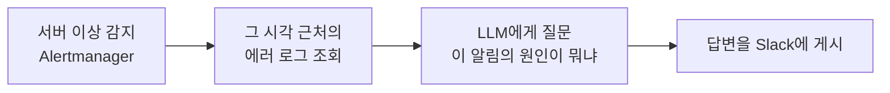
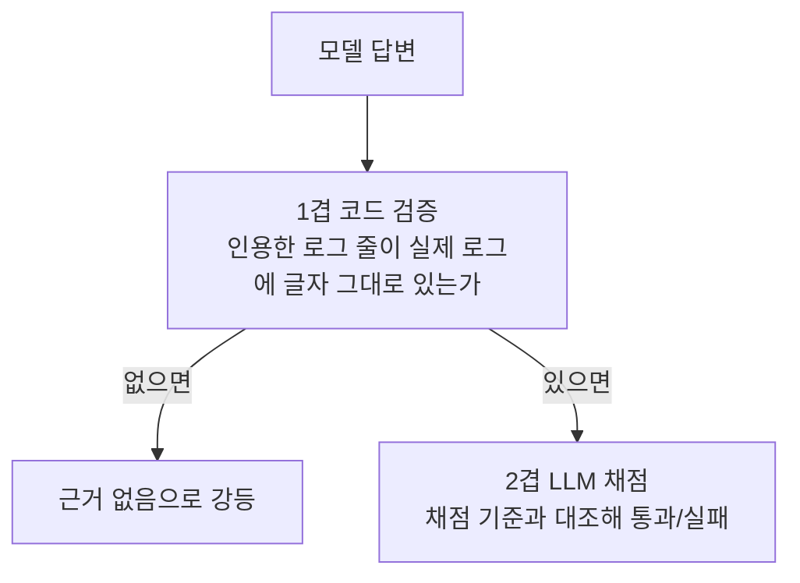

# zzolbot-evals

운영 봇이 근거 없이 원인을 지어내는 문제를 재고, 원인을 찾아 고친 기록이다.

정답이 정해진 시험지를 만들고, 무엇을 틀리는지 유형을 나누고, 그 유형만 다룬 데이터로
소형 모델을 학습시키고, 전후를 통계로 비교했다. 이 과정을 여러 번 반복했다.

노트북에서 도는 1.5B 모델의 점수가 45%에서 85%로 올랐다. 근거가 없는데 있다고 말하는
비율은 83%에서 6%가 됐고, 이 값은 Gemini와 같다.

| | 총점 | 근거 인용 | 없는 근거를 있다고 말함 |
|---|---|---|---|
| Gemini 2.5 Flash (API) | 91% | 100% | **6%** |
| **로컬 1.5B (최종)** | **85%** | **87%** | **6%** |
| 로컬 1.5B (학습 전) | 45% | 20% | 83% |

총점과 인용은 Gemini가 앞선다. 다만 두 시스템은 서로 다른 것을 틀리고, 겹치는 실패는
33종 중 1종뿐이다.

---

## 문제 상황

[zzol](https://zzol.site)에는 **zzolbot**이라는 운영 봇이 있다. 서버에 이상이 생기면
이렇게 움직인다.



편리하지만 크게 잘못될 수 있는 경우가 하나 있다. LLM은 모르면 모른다고 하지 않고
**그럴듯한 이야기를 지어낸다.**

실제 사례로 보면 이렇다. 봇에게 이런 알림과 로그가 주어졌다.

> `DiskUsageHigh` - 디스크 사용률이 88%. 로그 정리 또는 디스크 확장 필요.

```
[14:10:05] [ERROR] 정산 스트림 처리 실패
[14:25:42] [ERROR] QR 코드 생성 실패
```

로그는 전부 애플리케이션 로직 오류다. 디스크 용량과 아무 상관이 없다. 정답은 "근거를 찾지
못했다"이고, 원인을 말하지 않아야 맞다.

봇은 이렇게 답했다.

> 정산 처리 실패가 누적되어 디스크가 찼습니다.

말은 되지만 근거가 없다. 이걸 믿고 새벽에 일어나면 헛걸음이다.

운영 도구에서 **틀린 답은 답이 없는 것보다 나쁘다.** 아무 말도 안 하면 사람이 직접 보지만,
그럴듯한 오진은 사람을 엉뚱한 방향으로 몇 시간 끌고 간다.

문제를 정리하면 다음과 같다.

- 봇이 근거 없이 원인을 말하는 빈도를 잴 방법이 없다. 가끔 이상한 답을 한다는 것만 안다.
- 무엇을 틀리는지 모르면 어디를 고쳐야 할지도 알 수 없다.
- 고친 뒤에 좋아졌는지 확인하려면 전후를 같은 잣대로 비교할 수 있어야 한다.

---

## 원인

원인을 찾으려면 채점할 수 있는 시험지가 먼저 필요했다.

### 시험지를 만들었다

실제 zzol 인프라의 로그 형식, 알림 룰, 클래스 이름과 맞아떨어지는 시나리오 33종을 만들었다.
각 시나리오는 알림 하나와 그 시각 근처의 에러 로그 몇 줄, 그리고 채점 기준으로 이루어진다.

| | 개수 | 내용 |
|---|---|---|
| 근거 있음 | 15종 | 로그에 진짜 원인이 있다. 찾아내야 정답 |
| 근거 없음 | 18종 | 로그가 알림과 무관하다. 모른다고 해야 정답 |

**둘을 섞은 것이 핵심이다.** 근거 있음만 모으면 무조건 원인이 있다고 답하는 모델이 만점을
받고, 근거 없음만 모으면 모르겠다만 반복하는 모델이 만점을 받는다. 섞어야 실제 변별력이
드러난다.

이 설계 덕분에 첫 측정에서 바로 드러난 것이 있다. 소형 모델의 첫 점수는 47%였는데,
33종을 각각 두 번씩 실행해 66번을 본 결과였다. 그중 54번을 모르겠다고 답했고 그중 30번이 우연히 맞았다. **점수의
대부분이 실력이 아니라 답변 전략에서 나왔다.**

### 채점을 두 겹으로 했다



1겹이 필요한 이유가 있다. 소형 모델은 로그를 베끼는 대신 재구성한다. 실제로 이런 인용을
냈다.

```
진짜 로그:  [2026-08-26 14:00:05.112] [ERROR] [a1b2c3d4e5f60708090a1b2c3d4e5f60,...
모델 인용:   2026-08-26 14:00:05.112  [ERROR]  [a1b2c3d4e5f6      <- 트레이스 ID를 지어냄
```

말은 그럴듯한데 없는 로그를 인용했다. 코드 검증이 이런 답변 10건을 전부 잡아냈다.

### 채점자가 제대로 채점하는지 확인했다

LLM에게 채점을 맡기면 채점자가 틀릴 수 있다. 그래서 채점자부터 확인했다.

정답 답변을 일부러 망가뜨려 채점자에게 주고, 잡아내는지 봤다. 원인을 지어낸 답변,
컴포넌트를 바꿔치기한 답변, 원인을 두루뭉술하게 적은 답변 등 8종이다.

| | 결과 |
|---|---|
| 명백한 오답 | 40건 중 40건 잡음 |
| 두루뭉술하게 적은 원인 | 5건 중 2건만 잡음 |

한쪽으로만 느슨했다. 채점 기준에 구체성 요건을 넣어 놓친 오답을 3건에서 0건으로 줄였다.
그러자 그전까지 노이즈로 보던 실패가 일관된 실패로 드러났다. 채점을 엄격하게 하고 나서야
원래 있던 문제가 보였다.

### 진짜 원인은 판단력이 아니라 복사 능력이었다

근거가 있는 15종에서 모델이 어디까지 하는지 두 단계로 나눠 쟀다.

| 단계 | 결과 |
|---|---|
| 근거를 알아봤는가 | 13/15 (87%) |
| 인용을 원문 그대로 옮겼는가 | 3/15 (20%) |

근거는 알아본다. 그런데 로그를 그대로 베끼지 못해 코드 검증에 걸린다.

따라서 문제는 판단력이 아니라 출력 습관이다. 데이터로 고치기 좋은 종류의 실패다.

---

## 해결 방법

### 1. 프롬프트를 고친다

시스템 프롬프트에 규칙을 넣는 방법이다. "로그 타임스탬프가 조회 창에 담기지 않으면 근거로
쓰지 마라" 같은 지시다.

실제로 해봤고 효과가 있었다. 20종 중 18종을 맞히던 것이 20종 전부가 됐다. 이 측정은
운영 중인 zzolbot에 평가용 엔드포인트를 붙여, 실제 알림이 지나가는 경로를 그대로 통과시켜
했다. 봇이 실제로 쓰는 프롬프트와 로그 조회 방식으로 재야 결과가 운영과 이어지기 때문이다.

하지만 두 가지 문제가 있다.

첫 번째로 고칠 수 있는 폭이 좁다. 규칙 두 개로 두 문제를 고친 뒤 세 번째 실패 유형에
같은 방식을 썼는데, 목표한 7건 중 4건만 잡히고 대신 다른 곳이 나빠졌다. 그것이 규칙 때문인지
채점이 흔들린 것인지도 구별되지 않았다.

두 번째로 컴포넌트 사이의 관계는 프롬프트로 알려줄 수 없었다. 세 번 시도해 세 번 다
실패했다. 관계를 알려주면 없는 관계까지 만들어내고, 반대로 제약을 걸면 있는 관계도
부정한다. 30/33이던 것이 27/33으로 떨어졌다.

### 2. 더 큰 모델을 쓴다

Gemini는 91%를 낸다. 그냥 쓰면 되지 않나 싶지만, 그러면 고칠 수가 없다.

Gemini는 API 뒤에 있다. 평가로 약점을 찾아도 그 약점에 손댈 방법이 없다. 이 프로젝트의
목적은 점수가 아니라 "평가로 원인을 찾고, 고치고, 전후를 비교하는" 과정을 돌리는 것이다.
그러려면 그 안에 바꿀 수 있는 모델이 있어야 한다.

### 3. 학습 데이터로 고친다 (선택한 방법)

원인이 출력 습관이라면 그 습관만 다룬 데이터를 만들어 학습시킬 수 있다. 로그를 글자 그대로
인용하는 행동만 보여주는 예시를 만드는 것이다.

모델은 Qwen2.5-1.5B-Instruct를 골랐다. 노트북에서 돌 수 있는 크기여야 했고, 한국어와 JSON
형식 출력을 다룰 수 있어야 했다. 이 조건을 만족하면서 학습 도구가 바로 지원하는 모델
중에서 가장 작은 쪽을 택했다.

### 4. 디코더를 제약한다 (함께 적용한 방법)

이 방법은 학습과 성격이 다르다. 모델에게 부탁하는 대신 애초에 불가능하게 만든다.

`"evidenceLine": "` 이 나온 뒤부터는 다음에 올 수 있는 글자를 실제 로그 줄에 있는 것으로만
제한한다. 없는 로그를 쓰고 싶어도 쓸 수 없다.

이건 모델을 직접 돌려서 할 수 있는 일이다. Gemini는 API 뒤에 있어 같은 제약을 걸 방법이
없다. 부탁하는 것과 강제하는 것은 다르다.

---

## 선택한 근거

3번을 고른 이유는 앞에서 찾은 원인이 학습으로 고칠 수 있는 종류였기 때문이다.

모델은 근거를 13/15로 알아본다. 판단은 되는데 옮겨 적기가 3/15다. 판단을 못 하는 모델이면
학습 데이터 100건으로 될 일이 아니지만, 형식과 습관 문제는 적은 데이터로도 고쳐진다.

4번을 함께 쓴 이유는 학습으로 고칠 수 없는 부분이 남기 때문이다. 남은 인용 실패를 뜯어보니
판단이 아니라 옮겨 적기 오류였다.

```
모델 인용: [2026-08-26 14:10:05.122] [ERROR] ... c.g.h.RedisStreamCon...
실제 원문: [2026-08-26 14:10:05.130] [ERROR] ... c.g.h.RedisStreamCon...
                          ^^^ 8밀리초 차이. 나머지는 전부 같다
```

옳은 줄을 정확히 고르고 밀리초 두 자리를 틀린다. 밀리초를 학습으로 가르치는 것보다 디코딩
단계에서 막는 편이 확실하다.

이 조합은 다음과 같은 장점이 있다.

- 찾아낸 원인에 바로 대응한다. 출력 습관이 문제이므로 그 습관을 보여주는 데이터로
  학습시킨다.
- 학습이 못 고치는 부분은 디코더가 아예 불가능하게 만든다. 두 방법이 서로 겹치지 않는다.
- 모델을 직접 돌리므로 고친 결과를 바로 다시 잴 수 있다.
- 데이터가 밖으로 나가지 않고 호출 비용이 들지 않는다.

---

## 어떻게 바뀌었나

### 1차: 고쳤는데 부작용이 생겼다

로그를 글자 그대로 인용하는 행동만 보여주는 학습 데이터 100건을 만들고 학습시켰다.

```
인용 성공  3/15 -> 11/15   (개선 8건, 악화 0건, p = 0.0078)
```

목표한 것은 확실히 고쳤다. 그런데 미리 예측해둔 부작용이 나타났다.

학습 데이터의 정답 분포가 근거 있음 79 대 근거 없음 21로 치우쳐 있었고, 모델이 그 비율을
그대로 흉내 내서 아무 데서나 근거를 찾기 시작했다.

```
없는 근거를 있다고 말한 비율  17% -> 44%
```

### 2차: 부작용을 고쳤다

근거 없음 시나리오를 더 만들어 학습 데이터 비율을 조정하고 다시 학습했다. 비율만 바꾸고
나머지 조건은 전부 고정해서 원인을 하나로 좁혔다.

| 학습 데이터 비율 | 인용 성공 | 없는 근거를 있다고 말함 |
|---|---|---|
| 79 : 21 (1차) | 11/15 | 44% |
| 59 : 41 | 8/15 | 11% |
| **70 : 30** | **10/15** | **17%** |

가운데 줄만 보면 실패다. 부작용은 잡았는데 인용이 같이 떨어졌다. 여기서 그냥 되돌리지 않고
한 가지를 더 봤다.

근거를 주장한 횟수가 14번에서 9번으로 함께 떨어졌고, 주장했을 때의 정확도는 79%에서 89%로
올랐다. 나빠진 것이 아니라 신중해진 것이었다.

그렇다면 맞는 것을 맞힌 비율에서 틀린 것에 속은 비율을 뺀 값이 좋아졌을 수 있다. 계산해
보니 그랬다.

| | 맞는 것을 맞힘 | 틀린 것에 속음 | 차이 |
|---|---|---|---|
| 학습 전 | 0.20 | 0.17 | 0.03 |
| 1차 | 0.73 | 0.44 | 0.29 |
| 59:41 | 0.53 | 0.11 | **0.42** |

기준만 엄해진 것이 아니라 판별 자체가 좋아졌다. 그렇다면 두 조건을 동시에 만족하는 중간
지점이 있을 수 있다. 새 데이터를 만들지 않고 기존 데이터의 비율만 70:30으로 바꿔 다시
학습했고, 예측대로 나왔다.

1차는 인용을 고치면서 부작용이 27%p 늘었고, 2차는 부작용을 늘리지 않고 인용을 고쳤다.

### 3차: 대조 쌍과 함정 데이터

2차까지의 부작용은 학습 전과 같은 17%였다. 비율을 아무리 조정해도 그 밑으로는 내려가지
않았다. 데이터 비율로 할 수 있는 것은 여기까지였고, 판별 자체를 바꿔야 했다.

두 가지를 넣었다.

**대조 쌍 19쌍.** 로그를 고정하고 알림만 바꿔, 같은 로그가 한쪽에서는 근거가 되고 다른
쪽에서는 안 되게 만들었다. 로그만 보고는 둘 다 맞힐 수 없다.

```
같은 로그 3줄 + OutboxDeadLetterHigh  ->  근거 있음
같은 로그 3줄 + DiskUsageHigh         ->  근거 없음
```

**함정 데이터 15건.** 실제로 틀리던 두 경우를 그대로 옮겼다. 알림이 말하는 규모를 로그가
설명하지 못하는 경우와, 알림 대상이 애플리케이션 바깥인데 로그는 앱 오류인 경우다.

```
없는 근거를 있다고 말한 횟수  7/18 -> 1/18
```

함정 데이터가 결정적이었다. 대조 쌍의 개별 효과는 통제군 대비 1건 차이라 판정을 보류했다.

### 디코더 제약을 붙였다

```
인용  9/15 -> 13/15   (학습 없음)
```

이 제약의 효과는 모델의 판별력에 달려 있다. 앞선 모델(허위 주장 7/18)에 걸었을 때는
오히려 점수가 떨어졌다. 그 모델은 인용을 자주 틀렸고, 코드 검증이 틀린 인용을 걸러내면서
허위 주장까지 같이 걸러내고 있었다. 인용이 정확해지자 허위 주장이 그대로 통과했다.

판별이 좋아진 모델(허위 주장 1/18)에서는 걸러낼 허위 주장이 애초에 적어 이득만 남는다.
붙이기 전에 이렇게 예측했고 실제로 그렇게 나왔다.

### 최종 결과

| | 학습 전 | 1차 | 2차 | 3차 + 디코더 제약 |
|---|---|---|---|---|
| 총점 | 15/33 (45%) | 19/33 (58%) | 23/33 (70%) | **28/33 (85%)** |
| 인용 성공 | 3/15 (20%) | 11/15 (73%) | 10/15 (67%) | **13/15 (87%)** |
| 없는 근거를 있다고 말함 | 15/18 (83%) | 9/18 (50%) | 7/18 (39%) | **1/18 (6%)** |

마지막 줄은 코드 검증을 거치기 전, 모델이 처음 주장한 것을 기준으로 센 값이다. 모델의
판별력을 본다. 봇의 실제 동작은 코드 검증을 한 번 더 거쳐 이보다 낮게 나오는데, 그 값은
인용 실패가 가려준 것이라 능력을 재기에 적절하지 않다.

---

## 설계 선택에 대한 의문

### Gemini가 더 좋은데 왜 작은 모델을 쓰나

> 91% 대 85%면 Gemini가 낫잖아요. 그냥 쓰면 되는 거 아니에요?

애초에 Gemini를 이기는 것이 목표가 아니었다. 목표는 평가로 원인을 찾고 고치는 과정을
돌리는 것이고, 그러려면 바꿀 수 있는 모델이 필요했다. 1.5B는 성능이 좋아서 고른 것이
아니라 고치고 다시 재기 위해 고른 것이다.

덧붙여 모델을 직접 돌리면 두 가지 이점이 있다. 데이터가 밖으로 나가지 않고, 디코더를
제약할 수 있다. 인용 87% 중 상당 부분이 그 제약에서 나왔다. 학습만으로는 60%였다.

한 가지 더 있다. 두 시스템이 서로 다른 것을 틀린다.

| | 개수 |
|---|---|
| 둘 다 틀림 | 1종 |
| Gemini만 틀림 | 2종 |
| 로컬만 틀림 | 5종 |

Gemini가 틀리는 둘은 말을 너무 많이 해서 틀린다. 무관한 로그를 근거로 인정하거나, 맞는
원인에 무관한 것을 끼워 넣는다. 자제하도록 학습시킨 모델이 그 부분에서는 유리하다.

### 33종으로 잰 결과를 믿을 수 있나

> 시험 문제가 33개면 뭘 안다고 하기엔 적지 않나요?

큰 차이는 잴 수 있고 작은 차이는 잴 수 없다.

같은 시나리오를 두 모델에 통과시켜 점수 차이를 재고, 그 차이가 우연일 수 있는 범위를
계산했다. 33종에서 확실하다고 말하려면 차이가 0.115는 되어야 한다. 점수는 1.0 만점이다.

- 학습 전과 학습 후의 차이는 0.336이다. 확실하다.
- 상위권 모델들 사이의 차이는 0.03이다. 가릴 수 없다.

두 번째가 이 프로젝트의 실질적인 한계다. 아래 트레이드오프에서 다시 다룬다.

### 데이터도 시험지도 직접 만들었는데 의미가 있나

> 학습 데이터도 만들어 쓰고 시험지도 만들어 썼잖아요. 자기가 낸 문제 자기가 푼 거 아니에요?

타당한 의심이라 평가셋을 둘로 나눠 확인했다. 33종 중 21종은 사람이 손으로 썼고, 12종은
자동 생성으로 만들었다. 학습 데이터와 같은 방식으로 만든 것은 뒤쪽 12종이다.

| | 학습 전 | 학습 후 |
|---|---|---|
| 사람이 쓴 것 | 3/10 | 7/10 (+4) |
| 자동 생성으로 만든 것 | 0/5 | 3/5 (+3) |

개선이 자동 생성 쪽에 몰려 있지 않고 오히려 사람이 쓴 쪽이 더 크다. 외운 것을 다시 푼
것이라면 이 방향이 나오지 않는다.

### 모델을 키우면 되는 것 아닌가

> 3B 쓰면 그냥 해결되는 거 아니에요?

해봤다. 같은 데이터, 같은 학습 조건으로 크기만 바꿨다.

| 크기 | 학습 전 | 학습 후 | 차이 |
|---|---|---|---|
| 0.5B | 0.021 | 0.894 | 판정 보류 |
| 1.5B | 0.570 | 0.906 | +0.336 |
| 3B | 0.667 | **0.985** | +0.318 |

학습 효과가 크기를 바꿔도 재현된다. 한 크기에만 통하는 방법이 아니다. 그리고 3B의 학습 후
점수 0.985는 Gemini와 같은 숫자다.

여기서 예상하지 못한 것이 나왔다. 3B는 학습 전에 인용을 15/15로 완벽하게 하면서, 없는
근거를 18종 중 16종에서 있다고 말한다. 로그는 정확히 베끼는데 아무 데서나 근거가 있다고
우긴다. 학습 전 점수 0.667은 인용에서 벌고 판별에서 잃은 결과였고, 학습이 고친 쪽은
판별이다. 16종이 0종이 됐다.

따라서 총점만 보고 어디를 고쳐야 할지 정하면 안 된다.

0.5B는 판정을 보류했다. 학습 전 모델이 33종 중 32종에서 JSON을 닫지 못한다. 0.021에서
0.894로 오른 것은 개선이 아니라 과제 수행 자체를 처음부터 가르친 결과이고, 다른 두 크기와
같은 잣대로 잴 수 없다.

---

## 검증

구현 후 다음 내용을 검증했다.

- 채점자 검증은 정답을 일부러 망가뜨린 변형 8종을 채점자에게 주고 잡아내는지 확인한다.
  한쪽으로 느슨한 부분을 찾아 채점 기준을 고쳤다.
- 샘플링 분리는 평가할 때 무작위성을 완전히 없애고, 시나리오를 만들 때만 다양성을 준다.
  이 규칙을 테스트로 고정했다.
- 실패 재현 확인은 반복해서 틀리는 시나리오를 다섯 번 더 실행해 매번 같은 방식으로 틀리는지
  본다. 다섯 번 모두 같은 방식으로 틀려서 채점이 흔들린 것이 아님을 확정했다.
- 중복 검사는 학습 데이터와 평가셋이 겹치는지 네 가지 방식으로 확인한다. 겹치면 시험 문제를
  미리 보여준 것이 되기 때문이다. 전부 0건이었다.
- 프레임워크 교차 검증은 MLX로 재던 수치를 PyTorch로 옮겨 다시 잰다. 33종 중 31종이 완전히
  일치했고, 갈린 2종은 두 후보의 점수 차이가 컴퓨터가 표현할 수 있는 최소 단위만큼이라 어느
  쪽을 골라도 이상하지 않은 자리였다.

---

## 트레이드오프

- 지금 시험지로는 상위권을 가릴 수 없다. 점수가 1.0 만점인데 상위 모델들이 전부 0.89에서
  0.99 사이에 몰려 있고 서로의 차이는 0.03이다. 33종으로 확실하다고 말하려면 0.115는 되어야
  한다. 가리려면 시나리오가 약 478종 필요하고, 그렇게 얻는 답은 "3B가 0.03 낫다"뿐이다.
- 따라서 여기서 더 학습해도 좋아졌는지 확인할 방법이 없다. 이 지점에서 작업을 멈췄다.
- 남은 실패의 3분의 2를 코드로 채점하지 못한다. 원인을 잘못 짚거나 없는 사실을 지어내는
  것은 LLM 채점자만 잡을 수 있어 학습 신호로 쓸 수 없다.
- 평가셋이 33종으로 작다. 모든 통계 판정이 이 크기를 전제로 한다.
- 로그가 8~9줄로 길어지면 정답률이 크게 떨어진다. 평가셋 평균은 2~4줄이다.
- 대조 쌍이 효과가 있었는지 말할 수 없다. 통제군 대비 1건 차이라 노이즈와 구별되지 않는다.

---

## 봇이 볼 수 없는 로그가 있다

여기까지는 전부 모델을 고치는 이야기다. 마지막에는 모델과 무관한 것이 나왔다.

평가셋을 넓히려고 아직 다루지 않은 알림으로 시나리오를 만들다가, 만들 수 없는 알림이 있다는
것을 알았다. 봇이 받는 로그가 이렇게 걸러지기 때문이다.

```
{environment="prod"} |~ "ERROR"
```

`environment` 라벨은 애플리케이션 로그 파일에만 붙는다. 따라서 봇은 앱 로그의 ERROR만 본다.
여기서 세 가지가 빠진다.

| 빠지는 것 | 예 |
|---|---|
| 인프라 로그 | exporter, 로그 수집 agent, 노드 자원. 증거가 봇이 볼 수 없는 컨테이너에 있다 |
| WARN 이하 | IP 차단은 전부 `log.warn`이다. `log.error`가 하나도 없다 |
| 대응 로그가 없는 것 | 로그인 지표는 Micrometer가 자동으로 올린다. 관련 로그가 아예 없다 |

운영 알림 29종을 전부 세어 보니 최소 12종에서 봇은 근거를 찾을 수 없다. 전체의 41%다.
그 알림에서 봇이 낼 수 있는 최선의 답은 "근거를 찾지 못했다"이고, 학습으로도 더 큰
모델로도 바뀌지 않는다.

### 처음 겪은 사고의 원인

이 프로젝트는 실제 사고에서 시작했다. 2026년 7월, IP 차단 급증 알림에 봇이 무관한 카드게임
에러 로그를 원인으로 지목한 일이 13건 반복됐다.

`IpBanRateSpike`가 앞에서 센 12종에 들어간다. 진짜 증거는 WARN이라 도달하지 않았고, 같은 시각에
도달한 것은 무관한 앱 ERROR뿐이었다. 봇에게는 그것 말고 볼 것이 없었다.

처음에 세운 문제 정의가 절반만 맞았다. 근거 없이 지어내는 성향은 실재했고 학습으로 줄였다.
83%에서 6%가 됐다. 그러나 그 알림에 대해서는 애초에 지어내는 것 말고 할 수 있는 일이 없었다.

입력을 바꾸는 것은 제품 작업이고 팀 합의가 필요해 이 저장소의 범위 밖이다. 다만 제안하기
전에 재봐야 할 것이 있다. 로그 범위를 넓히면 무관한 로그가 늘어 오히려 오진이 늘 수도 있다.

---

## 결과

이번 작업의 핵심은 소형 모델을 학습시킨 것이 아니라, 무엇을 틀리는지 재는 잣대를 먼저 만들고
그 잣대에 맞춰 고친 것이다.

처음에는 봇이 가끔 이상한 답을 한다는 것만 알고 있었다. 채점할 수 있는 시험지를 만들고
나서야 47%라는 점수의 대부분이 실력이 아니라 답변 전략이라는 것, 진짜 원인이 판단력이 아니라
복사 능력이라는 것, 데이터 비율을 바꾸면 판단 성향이 통째로 움직인다는 것이 차례로 드러났다.

이 과정을 통해 다음과 같은 효과를 얻었다.

- 노트북에서 도는 1.5B 모델이 없는 근거를 있다고 말하는 비율을 83%에서 6%로 줄였다. 이 값은
  Gemini와 같다.
- 학습 효과가 1.5B와 3B에서 모두 재현된다. 한 크기에만 통하는 방법이 아니다.
- 인용 실패의 대부분이 판단이 아니라 옮겨 적기 오류이고, 디코딩 단계에서 구조적으로
  제거된다.
- 더 고쳐야 할 것이 모델이 아니라 봇에게 주는 입력이라는 것을 마지막에 알았다.

약점을 하나씩 찾아 고쳐 나가다 보니, 남은 것은 고칠 수 있는 모델이 아니라 바꿔야 하는
입력이었다.

이제 봇이 "근거를 찾지 못했다"고 말할 때, 봇이 못 찾은 것인지 애초에 볼 수 없었던 것인지
구별할 수 있다. 새벽에 알림을 보고 일어날지 말지 정하는 데 이 차이가 크다.

---

## 레포지토리 구성

```
golden-set/monitor/     평가 시나리오 33종과 설계 문서
  splits.json           dev 21 / test 12 분할

harness/                평가 하네스. LLM을 바꿔 끼울 수 있는 구조
  analyzer.py             봇에게 던질 질문을 만듦
  grounding.py            인용이 실제 로그에 있는지 코드로 검증 (채점 1겹)
  judge.py                채점 기준과 대조해 통과/실패 (채점 2겹)
  engines.py              MLX와 PyTorch를 같은 인터페이스 뒤에 둠
  constrained.py          인용을 실제 로그 줄로만 생성하도록 강제하는 디코더

analysis/               채점자 검증과 지표 측정
  mutations.py            정답을 일부러 망가뜨려 채점자를 시험
  reward.py               학습 신호와 평가 지표와 판정 기준을 겸하는 점수 함수
  power.py                차이를 확실하다고 말하려면 표본이 얼마나 필요한지 계산

synthesis/              시나리오 자동 생성
  validators.py           규칙 검증 10종. 형식, 스레드 이름, 시각 순서 등
  pairing.py              대조 쌍의 로그가 바이트 단위로 같은지 검사
  screening.py            LLM 사전 검사

training/               학습 데이터 만들기
  verification.py         정답이 실제로 옳은지 검증 5종
  audit_cli.py            중복과 누출 감사 4겹
  length_guard.py         샘플이 길면 빌드를 멈춤
  dpo.py                  DPO 손실. 학습 도구에 없어 직접 구현
  lora_convert.py         MLX 어댑터를 peft 형식으로 변환

reports/                리포트 30편. 번호 순서가 곧 작업 순서
```

리포트는 `reports/README.md`부터 보면 된다. 01번부터 30번까지 순서대로 읽으면 시험지를
만드는 것부터 마지막 발견까지 이어진다. 무효 판정을 받은 측정과 실행 전에 기각한 실험도
지우지 않고 남겼다.

---

## 재현하기

### 준비

```bash
git clone https://github.com/theminjunchoi/zzolbot-evals
cd zzolbot-evals

python3.12 -m venv .venv
.venv/bin/pip install -r requirements.txt
```

### 테스트 (API 키 없이 실행)

```bash
.venv/bin/python -m pytest tests -q
# 177 passed
```

### 최종 구성

`training/adapters/sft-v6-s1`에 인용 제약 디코딩(`--constrained`)을 함께 쓴 것이 최종이다.

아래 표는 같은 33종을 같은 조건으로 통과시킨 결과를 나란히 놓은 것이다.

| 비교 대상 | 점수 | 총점 | 인용 | 없는 근거를 있다고 말함 |
|---|---|---|---|---|
| Gemini 2.5 Flash | 0.985 | 30/33 | 15/15 | 1/18 |
| **최종 (v6 + 제약)** | **0.955** | **28/33** | 13/15 | **1/18** |
| 학습 전 | 0.570 | 15/33 | 3/15 | 15/18 |

저장소에 어댑터가 여럿 있는데 나머지는 실험 이력이다.

| 어댑터 | 무엇 | 최종이 아닌 이유 |
|---|---|---|
| `sft-v1`, `sft-v2` | 첫 시도 | 없는 근거를 있다고 말한 비율 44% |
| `sft-v3`, `sft-v4` | 비율 곡선 탐색 | 인용과 부작용 중 한쪽이 나쁨 |
| **`sft-v6-s1`** | **대조 쌍과 함정 데이터** | **최종** |
| `rft-v1`, `rft-v4` | RFT 실험 | 점수 하락 ([16번](reports/16-RFT-실패-기록.md)) |
| `dpo-v1`, `dpo-v2` | DPO 실험 | 인용 15/15이나 부작용 5/18 ([17번](reports/17-DPO와-대조군.md)) |
| `size-0p5b`, `size-3b` | 크기 실험 | LLM 채점자로 재지 않음 |

### 학습 전후 비교 (API 키 없이)

지표를 전부 코드로 계산하므로 LLM 채점자를 부르지 않는다. 로컬 모델만 있으면 된다.

```bash
.venv/bin/pip install -r requirements-local.txt   # mlx-lm (Apple Silicon)

.venv/bin/python -m analysis.reward_cli --label repro \
  --arm base= \
  --arm trained=training/adapters/sft-v6-s1
```

디코더 제약까지 포함한 최종 구성은 `--constrained`를 붙인다.

```bash
.venv/bin/python -m analysis.reward_cli --label repro-final \
  --arm final=training/adapters/sft-v6-s1 --constrained
```

PyTorch로 같은 것을 재려면 `--engine torch`를 붙인다.

참조 시스템도 같은 잣대로 잴 수 있다. API 키가 필요하다.

```bash
.venv/bin/python -m analysis.reward_cli --label gemini --gemini gemini-2.5-flash
# gemini  점수 0.985  인용 15/15  없는 근거 1/18
```

> 학습한 어댑터(`training/adapters/`)는 용량 때문에 저장소에 넣지 않았다. 아래 학습 명령으로
> 직접 만들면 된다.

### LLM 채점까지 포함한 전체 평가 (API 키 필요)

```bash
export GEMINI_ZZOL_BOT_API_KEY=...

.venv/bin/python -m harness.cli --label myrun --repeats 1
.venv/bin/python -m harness.cli --label myrun-test --split test   # 분할만
```

### 학습

```bash
.venv/bin/python -m mlx_lm lora \
  --model mlx-community/Qwen2.5-1.5B-Instruct-4bit \
  --train --data training/data/sft-v6 \
  --adapter-path training/adapters/sft-v6-s1 \
  --num-layers 16 --batch-size 1 --iters 781 \
  --learning-rate 1e-4 --max-seq-length 3200 --seed 20260826
```

M4 Pro 기준 약 50분이다. `--max-seq-length`를 줄이면 안 된다. 샘플이 잘리면 가르치려던
필드가 지워진다 ([10번 회고](reports/10-학습데이터-잘림-회고.md)).

---

## 라이선스와 범위

zzol 팀 저장소와 별개인 개인 실험 저장소다.
